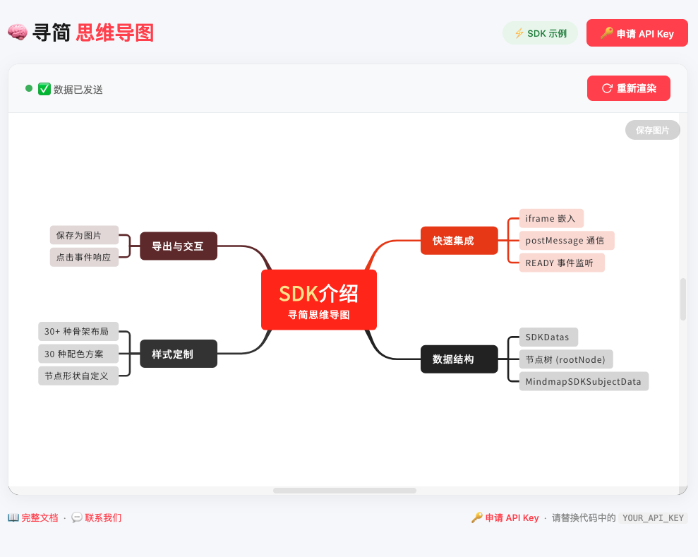

# mindmap-sdk

# 🧠 寻简思维导图 SDK · 示例项目

> 一行代码，为你的产品注入 AI 思维导图能力

这个仓库包含了**寻简思维导图 SDK** 的完整集成示例。你可以直接运行 `examples/vanilla-js/index.html`，体验从 **iframe 嵌入 → SDK 就绪 → 数据发送 → 思维导图渲染** 的完整流程。

---

## ✨ 效果预览



中心节点展示「SDK介绍 · 寻简思维导图」，四个分支分别覆盖 **快速集成、数据结构、样式定制、导出与交互**，子节点进一步细化了每个分支的核心能力。

---

## 🚀 快速开始

### 1️⃣ 获取 API Key

访问 [寻简思维导图开放平台](https://www.mindyushu.com/api.html)，登录后创建 API Key。

> ⚠️ **注意**：API Key 仅在创建时显示一次，请妥善保存。

### 2️⃣ 运行示例

```bash
# 克隆仓库
git clone https://github.com/your-username/xunjian-mindmap-sdk-examples.git
cd xunjian-mindmap-sdk-examples

# 直接用浏览器打开示例（无需安装任何依赖）
open examples/vanilla-js/index.html
```

### 3️⃣ 替换 API Key

在 `examples/vanilla-js/index.html` 中找到 `API_KEY` 变量，替换为你的 Key：

```javascript
const API_KEY = '你的_API_Key';
```

刷新页面，思维导图即可渲染。

---

## 📁 项目结构

```
xunjian-mindmap-sdk-examples/
├── README.md
├── LICENSE
├── .gitignore
└── examples/
    └── vanilla-js/          # 原生 JavaScript 示例（当前）
        ├── index.html       # 完整示例代码
        └── README.md        # 示例说明
```

---

## 🧩 核心通信流程

```javascript
// 1. 嵌入 SDK
<iframe id="mindmap-sdk" src="https://web.mindyushu.com/sdk"></iframe>

// 2. 监听 READY 事件
window.addEventListener('message', function(event) {
    if (event.data.type === 'READY' && event.data.value === 'OK') {
        // 3. 发送思维导图数据（⚠️ 必须 JSON.stringify）
        iframe.contentWindow.postMessage({
            type: 'MINDMAP',
            data: JSON.stringify(sdkData)
        }, 'https://web.mindyushu.com');
    }
});
```

> 💡 **关键点**：`data` 字段必须使用 `JSON.stringify()` 序列化，否则 SDK 会解析失败。

---

## 📊 数据结构

```javascript
const sdkData = {
    ApiKey: 'your_api_key',      // 必填
    rootNode: {                   // 必填
        value: { text: '中心主题' },
        children: [ ... ]
    },
    styleIndex: 5,               // 配色方案 (0~29)
    frameworkIndex: 0,           // 布局骨架 (0~33)
    lineWidth: 2.5,
    lineLayout: 1,
    layout: 19,
    mindType: 1,
    mindBGColor: 0xffffff,
    showSaveImageButton: true,
    lineColors: [ ... ]          // 可选，自定义线条颜色
};
```

## 🎨 内置配色 & 布局

| 特性 | 数量 | 说明 |
|------|------|------|
| **骨架布局** | 30+ 种 | 思维导图、流程图、组织结构图、时间线等 |
| **配色方案** | 30 套 | 开箱即用，也支持自定义 |

## 📚 相关链接

| 链接 | 说明 |
|------|------|
| [开放平台](https://www.mindyushu.com/api.html) | 申请 API Key |
| [SDK 文档](https://www.mindyushu.com/help.html) | 完整 API 文档 |
| [商业说明](https://www.mindyushu.com/buy.html) | 定价与套餐 |

## 📄 许可证

MIT License © 2026 上海玉数科技有限公司

## 🤝 贡献

欢迎提交 Issue 和 Pull Request！如有问题，请联系客服微信：`yushu_mindmap`

---

**寻简思维导图 SDK —— 让思维可视化变得简单。**